<div align="center">
  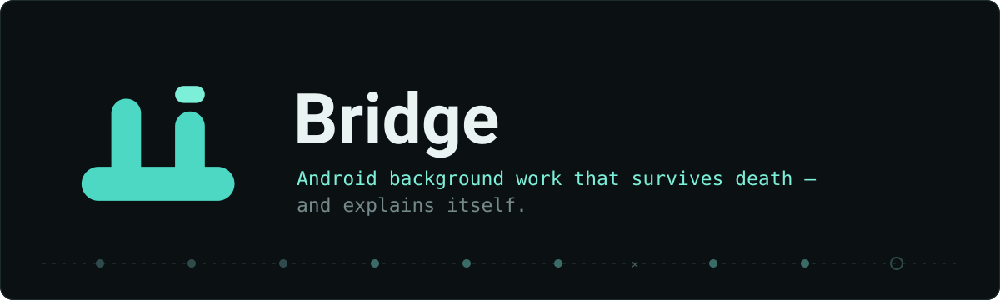
  <p>
    
    
    
    
    
  </p>
</div>

Bridge is an Android background-work runtime built directly on the platform's own primitives: an append-only event journal, JobWorkItem-multiplexed dispatch, death forensics via `ApplicationExitInfo`, and measured cost via `HealthStats`. Work interrupted by process death resumes where it stopped, and every deferred or held job can explain why, backed by the platform's own reporting.

## Contents

- [Key results](#key-results)
- [Adoption tiers](#adoption-tiers)
  - [Tier 0 — Glassbox: diagnostics for any app](#tier-0--glassbox-diagnostics-for-any-app)
  - [Tier 1 — Compat: an androidx.work façade](#tier-1--compat-an-androidxwork-façade)
  - [Tier 2 — Runtime: the full engine](#tier-2--runtime-the-full-engine)
  - [Tier 3 — Durable coroutines](#tier-3--durable-coroutines)
  - [Tier 4 — Simulator](#tier-4--simulator)
- [Bridge vs WorkManager](#bridge-vs-workmanager)
- [Measurements](#measurements)
- [Performance](#performance)
- [Status and roadmap](#status-and-roadmap)
- [Documentation](#documentation)

## Key results

Measured on physical hardware, API 36 (2026-07). Identical workloads were run against both backends. Raw reports: [`bench/scripts/reports/`](bench/scripts/reports/).

| Scenario | Bridge | WorkManager |
|---|---|---|
| Force-stop mid-upload (20 chunks) | Resumed at the in-flight chunk — **1** chunk replayed | Restarted from chunk 0 — **20** chunks replayed |
| Time to complete after kill | **61,350 ms** | 72,346 ms |
| Stall diagnosis under forced idle | `DeferredByDoze(deep)` `[REPORTED]` | `RUNNING` — stale; the job had already been stopped |
| Durable coroutine force-stopped mid-`delay(20s)` | **SUCCEEDED**, each step exactly once | Not supported |


*Force-stop behavior, measured on device: Bridge replayed 1 chunk; WorkManager replayed 20 — rescheduled, not resumed.*


*The same stall, queried through both APIs. Bridge returns the platform-reported cause; WorkManager reports a stale RUNNING state.*

The durable-coroutine result — force-stopped mid-`delay(20s)`, timer elapsing while the process was dead, completing with each step executed exactly once — is covered in [Tier 3](#tier-3--durable-coroutines). Full measurement panels: [Measurements](#measurements).

## Adoption tiers

Bridge is adopted incrementally. Each tier is useful on its own, and every step is reversible.

| Tier | Name | Module | Provides | Adoption cost |
|---|---|---|---|---|
| 0 | Glassbox | `bridge-glassbox` | Diagnostics for any app's existing jobs | Two lines; nothing to migrate |
| 1 | Compat | `bridge-compat` | `androidx.work`-shaped façade; chains resume at the failed link | An import change |
| 2 | Runtime | `bridge-runtime` | Full engine: constraints, chunks, deadlines, periodic, diagnostics | Native API adoption |
| 3 | Durable coroutines | `bridge-runtime` | Suspend blocks that survive process death | Builds on Tier 2 |
| 4 | Simulator | `bridge-sim` | JVM device regimes in milliseconds, for tests | Test-only dependency |

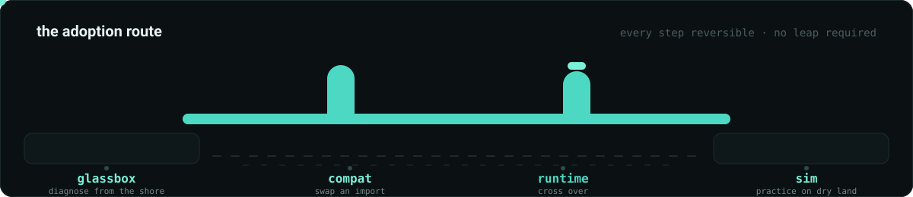

### Tier 0 — Glassbox: diagnostics for any app


Glassbox requires no migration. WorkManager jobs are the app's own JobScheduler jobs, so the platform already reports on them (pending reasons, API 34+); two lines of integration expose that report.

```kotlin
// Application.onCreate
GlassBox.install(this)

// Anywhere, later:
Log.i(TAG, GlassBox.explain().render())
// device: DeferredByStandbyBucket(RARE), DeferredByDoze(deep)
// jobs:   3 pending — DeferredByDoze(deep) [REPORTED]
```

`GlassBox.explain()` returns a typed `Explanation`: device-level causes, per-job platform-reason causes, basis (`REPORTED` vs `INFERRED`), and the raw signal evidence.

### Tier 1 — Compat: an androidx.work façade


Existing workers are unchanged; only the import changes. For the covered surface, migration is an import change:

```kotlin
// before: import androidx.work.*
import io.github.iamjosephmj.bridge.compat.*

class SyncWorker : Worker() {
    override fun doWork(): Result = try {
        api.sync(); Result.success()
    } catch (e: IOException) { Result.retry() }
}

BridgeWorkManager.enqueueUniqueWork("sync", ExistingWorkPolicy.KEEP,
    OneTimeWorkRequest.Builder(SyncWorker::class.java)
        .setConstraints(Constraints.Builder()
            .setRequiresCharging(true)
            .setRequiredNetworkType(NetworkType.UNMETERED).build())
        .build())
```

Chains compile to a single Bridge item whose links are chunks, so an interrupted chain resumes at the failed link — which WorkManager cannot do:

```kotlin
BridgeWorkManager.beginUniqueWork("publish", ExistingWorkPolicy.KEEP, uploadRequest)
    .then(createPostRequest)
    .then(commitRequest)
    .enqueue()
```

Covered surface:

| Area | Coverage |
|---|---|
| One-time work | `OneTimeWorkRequest`, `enqueueUniqueWork` (KEEP), `setInitialDelay` |
| Periodic work | `PeriodicWorkRequest`, `enqueueUniquePeriodicWork` (KEEP / UPDATE) |
| Constraints | Full `Constraints.Builder` surface: charging, network type, battery-not-low, storage-not-low, device-idle |
| Chains | `beginUniqueWork(...).then(...).enqueue()` — resumes at the failed link |
| Introspection and control | `getWorkInfoState`, `cancelUniqueWork` |

Full guide: [`docs/MIGRATION.md`](docs/MIGRATION.md).

### Tier 2 — Runtime: the full engine


The complete engine — the layer every result above runs on.

#### Enqueue with the constraint DSL

```kotlin
// Application.onCreate — register worker factories at every process start
Bridge.initializeAsync(this) {
    worker("sync") { SyncWorker() }          // BridgeWorker: suspend fun run(ctx): RunResult
}

Bridge.enqueue(workRequest("nightly-sync", "sync") {
    network()                    // any connected network (unmetered() for Wi-Fi-class)
    charging()
    batteryNotLow()
    storageNotLow()
    deviceIdle()                 // JobInfo.setRequiresDeviceIdle
    contentTrigger("content://media/photos", descendants = true)  // JobInfo.TriggerContentUri
    importance(Importance.LOW)   // feeds the policy engine, not just the platform:
                                 // LOW yields under quota and thread pressure; HIGH never waits
    maxThreadPressure(PressureLevel.MEDIUM)  // dispatch only while runnable threads <= cores x 2;
                                 // overrides the importance-derived pressure default
    initialDelay(10 * 60_000L)   // exact-path setMinimumLatency
    maxAttempts(5)
    mustCompleteBy(tomorrow6amMs)  // deadline escalation: DEFAULT -> EXPEDITED -> while-idle alarm
})

// Repeating work — each cycle is a journaled generation; cancel ends the series:
Bridge.enqueue(workRequest("heartbeat", "sync") {
    periodic(30 * 60_000L)       // >= 15 min, the platform floor
})
```

Enqueue has KEEP semantics per unique name. `initializeAsync` keeps journal-open and reconciliation off the main thread; early callers suspend on `Bridge.awaitReady()`.

#### Chunked resumption

```kotlin
class PhotoBackupWorker : ChunkedWorker {
    override suspend fun runChunk(ctx: RunContext, chunkIndex: Int): RunResult {
        uploader.upload(part = chunkIndex)   // small, independently-committed unit
        return RunResult.Success
    }
}

Bridge.initializeAsync(this) {
    worker("photo-backup") { PhotoBackupWorker() }
}

Bridge.enqueue(workRequest("backup", "photo-backup") {
    chunks(40, estimatedUpBytes = 200_000_000L)
    unmetered(); charging()
    importance(Importance.LOW)
})
```

Every completed chunk is journaled. After a stop, crash, or force-stop mid-run, the next attempt starts at `WorkState.nextChunk`, not chunk 0. This is the exact configuration behind the 1-vs-20 result above.

#### Diagnostics

Three questions Bridge always answers: why isn't it running, what happened last time, and how is everything. All three are total functions — no nulls to defend against; unknown names get an `UnknownWork` verdict.

```kotlin
Bridge.whyPending("photo-backup").render(now)
// ENQUEUED 4h 12m — DeferredByStandbyBucket(RARE) [INFERRED]
//   contributing: DeferredByDoze(deep)
//   evidence:
//     STANDBY_BUCKET    Bucket(RARE)  t=...  BROADCAST
//     DOZE              Doze(DEEP)    t=...  BROADCAST

Bridge.ledger("photo-backup")
// per-attempt history: dispatch/start/end times, outcome (Completed / Stopped /
// Died(exitReason) / Cancelled / InFlight), chunk range executed, HealthStats
// cost delta, and the signal-log slice — "died mid-run" becomes
// "died mid-run during deep Doze"

Bridge.report().render(now)
// backup              ENQUEUED   DeferredByDoze(deep)
// nightly-sync        SUCCEEDED
// telemetry           ENQUEUED   HeldByPolicy(thread pressure MEDIUM (runnable 12 / 8 cores)
//                                — deferring importance 1 work)
// publish-post        ENQUEUED   DurableParked(delay until 14:02)
// conformance: MULTIPLEXED · signal log: 412 transitions / oldest 3d
```

The same report is available from adb with no code changes:

```
adb shell am broadcast -a io.github.iamjosephmj.bridge.REPORT \
    -n <pkg>/io.github.iamjosephmj.bridge.diagnostics.ReportReceiver
```

Implementation details — the layer stack, event-sourced journal, deterministic replay, policy engine, and signal hub — are documented in [`docs/INTERNALS.md`](docs/INTERNALS.md). Nothing there is required to use Bridge.

### Tier 3 — Durable coroutines


Background logic as ordinary suspend functions that survive process death — a deterministic-replay model in the style of Temporal, on-device, with no continuation serialization:

```kotlin
// Must run on a path that executes at every process start (Application.onCreate) —
// relaunching IS the recovery path, the same reachability rule WorkManager
// places on its worker classes. launch() has KEEP semantics: if the work is
// already live in the journal, this re-registers the block and reattaches.
val handle = Bridge.scope().launch("publish-post") {
    // step(): the only place for effects. Executes once ever — after a process
    // death, replay returns the journaled result instantly without re-running it.
    val media = step("upload") { uploader.upload(draft.attachments) }

    // Journaled timer backed by an alarm. The block parks (unwinds without burning
    // an attempt); the process can die here and the alarm still fires. On wake,
    // replay fast-forwards through "upload" and resumes at this exact point.
    delay(2.hours)

    // Parks until the signal hub satisfies the predicate; satisfaction is journaled.
    await("validated-net") { it.values[SignalKind.NETWORK_VALIDATED] == SignalValue.Flag(true) }

    // Runs only after relaunch if the process died above — exactly once.
    step("commit") { db.markPublished(media) }
}

handle.join()                    // suspends until terminal state
val end = handle.await()         // same, returning SUCCEEDED / FAILED / CANCELLED
handle.whyPending()              // e.g. DurableParked(delay until 14:02)
```

The contract is small: effects live inside `step()`, and code between steps stays deterministic (time via `now()`, randomness via `random()`). Shape changes mid-flight fail loudly via a positional structure guard rather than corrupting silently. Parks are first-class (`RunResult.Parked`): they never burn attempts and never read as crashes.

Device-verified: force-stopped mid-`delay(20s)` and relaunched after the timer elapsed while the process was dead.


*Step counters persist on-device precisely because process memory does not — that is the scenario. The simulator's signature test additionally survives death at +30 min and deep Doze for 1–3 h mid-`delay(2h)`. [Raw numbers](docs/RESULTS.md#durable-acceptance--force-stop-mid-delay).*

### Tier 4 — Simulator

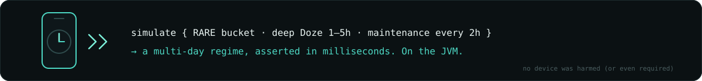

Multi-day device regimes asserted in milliseconds of JUnit. [`bridge-sim`](bridge-sim/README.md) scripts signal timelines and a fake clock over the real journal, dispatcher, runner, and diagnoser. Seven canonical scenarios ship as tests, including the stall mirror of the device result and the durable signature test.

```kotlin
simulate {
    worker("upload") { UploadWorker() }
    bucket(Buckets.RARE)
    doze(fromMs = 1.h, untilMs = 5.h, maintenanceEveryMs = 2.h)
    threadPressure(runnable = 12, fromMs = 2.h)   // MEDIUM on the sim's 8 cores
    val work = enqueue(workRequest("sync", "upload"))
    assertThat(work.verdictAt(3.h).diagnosis).isInstanceOf(Diagnosis.DeferredByDoze::class.java)
    assertThat(work.completedWithin(26.h)).isTrue()
}
```

Its scope is explicit: a logic assertion under a scripted regime, not a device guarantee — the [gating model](bridge-sim/README.md#the-gating-model-is-deliberately-simple) makes no attempt to reproduce OEM heuristics. Device truth comes from the instrumented suite and the benchmark harness ([`bench/`](bench/README.md), with its own [honesty rules](bench/README.md#honesty-rules)).

## Bridge vs WorkManager

A direct capability comparison, including the rows WorkManager currently wins.


*A filled dot means the row is supported; the highlight goes to whichever library wins the row — including the four rows WorkManager still does. [Raw table](docs/RESULTS.md#bridge-vs-workmanager).*

## Measurements

Raw markdown tables, citable: [`docs/RESULTS.md`](docs/RESULTS.md).


*Bridge re-executed only the chunk in flight at the kill; every completed chunk's result survived. WorkManager, with no resume primitive, restarted from chunk 0. [Raw numbers](docs/RESULTS.md#1-vs-20--force-stop-replay).*


*The RUNNING states are stale — the forced idle had already stopped those jobs. Bridge's verdicts carry `basis=REPORTED`: `getPendingJobReasons`, the platform's own explanation, not inference. [Raw numbers](docs/RESULTS.md#the-stall-verdict).*

## Performance

| Metric | Measured / design | Notes |
|---|---|---|
| Cold start | **318–334 ms, including Bridge init** | `initializeAsync` runs journal-open and reconciliation on a background dispatcher, so `Application.onCreate` returns without paying for it; `scope().launch` and `handle.await()` tolerate pre-init by gating on readiness internally |
| Steady-state main-thread cost | **~zero** | Journal writes go through a dedicated I/O executor; signal snapshots and diagnosis are pull-based, computed only on request |
| Metadata reads (KvStore) | **In-memory-first** | Lock-free `ConcurrentHashMap` reads over a `kv` table in `bridge.db`, DB-before-memory writes — hot-path metadata never touches disk on read |

## Status and roadmap

Bridge is stable and device-verified end to end: the full constraint surface, `initialDelay`, `periodic`, durable coroutines, the compat façade, the policy engine, and the glass box — with the measurements above to show for it.

| Roadmap item | Current state | Planned |
|---|---|---|
| Broader OEM matrix | Device verification on API 36 hardware | Extended verification across Samsung, Xiaomi, OnePlus and Oppo devices |
| Remaining WorkManager surface | `Data` payloads, tags, LiveData/Flow observers, and multi-branch chains remain on WorkManager (the compat façade keeps both runnable side by side) | Incremental coverage |
| Cost auto-demotion | `report()` flags LOW/MIN work measuring 3× the pool median | Automatic demotion as an opt-in |

## Documentation

| Document | Contents |
|---|---|
| [`docs/MIGRATION.md`](docs/MIGRATION.md) | Three-stage migration guide: glass box, import swap, native adoption |
| [`docs/INTERNALS.md`](docs/INTERNALS.md) | Implementation reference: layer stack, journal, replay, policy engine, signal hub |
| [`docs/RESULTS.md`](docs/RESULTS.md) | Measured results as citable tables |
| [`bridge-sim/README.md`](bridge-sim/README.md) | Simulator guide and gating model |
| [`bench/README.md`](bench/README.md) | Benchmark harness and honesty rules |

## License

License: TBD — not yet chosen. Until a license file lands, all rights reserved; open an issue if you want to use Bridge in the meantime.
