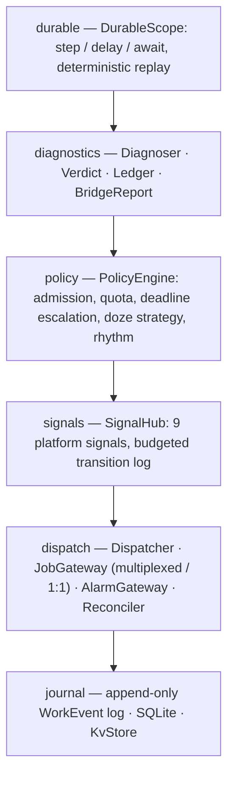

<div align="center">


<br>
<br>

     

<br>

<b>Bridge is a reimplementation of Android background work on what <code>system_server</code> actually offers:</b><br>
JobWorkItem-multiplexed dispatch, an append-only event journal, chunk-exact resumption,<br>
death forensics via <code>ApplicationExitInfo</code>, and measured per-run cost via <code>HealthStats</code>.

When the process dies mid-run, Bridge resumes at the exact chunk — or the exact coroutine step — it was on.<br>
When work stalls, Bridge tells you <i>why</i>, with the platform's own evidence attached.

</div>

---

## The two numbers

Both results measured on a physical <b>Pixel 6 Pro, API 36</b> (2026-07), same workload corpus on both backends. Raw reports: [`bench/scripts/reports/`](bench/scripts/reports/).

<div align="center">


<sub><b>Try killing it. It doesn't mind.</b> Measured on device: Bridge replayed <b>1</b> chunk; WorkManager replayed <b>20</b>.</sub>

<br>
<br>


<sub>Same stall, both APIs asked <i>why</i>. One of them answered. The other one said <b>RUNNING</b>, which was not true.</sub>

</div>

<details>
<summary><b>Raw numbers</b> (for citing)</summary>
<br>

**1 vs 20 — force-stop replay.** `force-stop` scenario, `large_chunked` (200 MB / 40 chunks), process killed mid-run and relaunched:

| metric | bridge | workmanager |
|---|---|---|
| attempts | 2 | 2 |
| chunks replayed | **1** | **20** |
| time to complete | 61,350 ms | 72,346 ms |

<sub>Bridge re-executed only the chunk in flight at the kill; every completed chunk's result survived. WorkManager, with no resume primitive, restarted from chunk 0.</sub>

**The stall verdict.** `stall` scenario: unplugged, demoted to RARE, deep Doze forced — then both APIs asked "why?":

| item | workmanager says | bridge says |
|---|---|---|
| ping | **RUNNING** | `DeferredByDoze(deep) [REPORTED]` |
| medium_sync | SUCCEEDED | `DeferredByDoze(deep) [REPORTED]` |
| large_chunked | **RUNNING** | `DeferredByDoze(deep) [REPORTED]` |
| large_chunked-uc | **RUNNING** | `DeferredByDoze(deep) [REPORTED]` |

<sub>WorkManager reports <b>RUNNING</b> for jobs the forced idle has stopped — a stale answer, not just an empty one. Bridge's verdicts carry <code>basis=REPORTED</code>: they come from <code>getPendingJobReasons</code>, the platform's own explanation, not inference.</sub>

</details>

<div align="center"><sub>And the crown result: a durable coroutine force-stopped mid-<code>delay(20s)</code>, relaunched after the timer elapsed while the process was dead — <b>SUCCEEDED</b>, each step executed exactly once. Details below.</sub></div>

---

## Quick start

Bridge is a ladder, not a leap. Each tier is independently useful and independently reversible.

<details open>
<summary><b>Tier 0 — GlassBox: diagnostics for ANY app (two lines, no scheduler)</b></summary>
<br>

Works even in pure-WorkManager apps: WorkManager's jobs are your app's own JobScheduler jobs, so their platform pending reasons (API 34+) are readable here.

```kotlin
// Application.onCreate
GlassBox.install(this)

// Anywhere, later:
Log.i(TAG, GlassBox.explain().render())
// device: DeferredByStandbyBucket(RARE), DeferredByDoze(deep)
// jobs:   3 pending — DeferredByDoze(deep) [REPORTED]
```

`GlassBox.explain()` returns a typed `Explanation` — device-level causes, per-job platform-reason causes, basis (`REPORTED` vs `INFERRED`), and the raw signal evidence.

</details>

<details>
<summary><b>Tier 1 — native enqueue with the full constraint DSL</b></summary>
<br>

```kotlin
// Application.onCreate — register worker factories at every process start
Bridge.initializeAsync(this) {
    worker("sync") { SyncWorker() }          // BridgeWorker: suspend fun run(ctx): RunResult
}

Bridge.enqueue(workRequest("nightly-sync", "sync") {
    network()                    // any connected network (unmetered() for Wi-Fi-class)
    charging()
    batteryNotLow()
    storageNotLow()
    deviceIdle()                 // JobInfo.setRequiresDeviceIdle
    importance(Importance.LOW)   // feeds the policy engine, not just the platform
    initialDelay(10 * 60_000L)   // exact-path setMinimumLatency
    maxAttempts(5)
    mustCompleteBy(tomorrow6amMs)  // L4 escalation: DEFAULT → EXPEDITED → while-idle alarm
})

// Or repeating — each cycle is a journaled generation; cancel ends the series:
Bridge.enqueue(workRequest("heartbeat", "sync") {
    periodic(30 * 60_000L)       // >= 15 min, the platform floor
})
```

Enqueue has KEEP semantics per unique name. `Bridge.initializeAsync` keeps journal-open + reconciliation off the main thread; early callers can suspend on `Bridge.awaitReady()`.

</details>

<details>
<summary><b>Tier 2 — chunked resumption (the 1-vs-20 primitive)</b></summary>
<br>

```kotlin
class PhotoBackupWorker : ChunkedWorker {
    override suspend fun runChunk(ctx: RunContext, chunkIndex: Int): RunResult {
        uploader.upload(part = chunkIndex)   // small, independently-committed unit
        return RunResult.Success
    }
}

Bridge.initializeAsync(this) {
    worker("photo-backup") { PhotoBackupWorker() }
}

Bridge.enqueue(workRequest("backup", "photo-backup") {
    chunks(40, estimatedUpBytes = 200_000_000L)
    unmetered(); charging()
    importance(Importance.LOW)
})
```

Every completed chunk is journaled. Stop, crash, or force-stop mid-run, and the next attempt starts at `WorkState.nextChunk` — not chunk 0. This is the exact configuration behind the device-verified 1-vs-20 result.

</details>

<details>
<summary><b>Tier 3 — durable coroutines: suspend blocks that survive process death (the crown demo)</b></summary>
<br>

Background logic as ordinary suspend functions, made durable via deterministic replay (Temporal's model, on-device) — not continuation serialization:

```kotlin
// Must run on a path that executes at every process start (Application.onCreate) —
// relaunching IS the recovery path, the same reachability rule WorkManager
// places on its worker classes. launch() has KEEP semantics: if the work is
// already live in the journal, this re-registers the block and reattaches.
val handle = Bridge.scope().launch("publish-post") {
    // step(): the only place for effects. Executes ONCE EVER — after a process
    // death, replay returns the journaled result instantly without re-running it.
    val media = step("upload") { uploader.upload(draft.attachments) }

    // Journaled timer → alarm. The block PARKS (unwinds without burning an
    // attempt); the process can die here and the alarm still fires. On wake,
    // replay fast-forwards through "upload" and resumes at this exact point.
    delay(2.hours)

    // Parks until the signal hub satisfies the predicate; satisfaction is journaled.
    await("validated-net") { it.values[SignalKind.NETWORK_VALIDATED] == SignalValue.Flag(true) }

    // Runs only after relaunch if the process died above — exactly once.
    step("commit") { db.markPublished(media) }
}

handle.join()                    // suspends until terminal state
val end = handle.await()         // same, returning SUCCEEDED / FAILED / CANCELLED
handle.whyPending()              // e.g. DurableParked(delay until 14:02)
```

Contract: effects belong inside `step()`; code between steps must be deterministic (time via `now()`, randomness via `random()`). Shape changes mid-flight fail explicitly via a positional structure guard, never silently corrupt. Parks are first-class (`RunResult.Parked`): they never burn attempts and never read as crashes.

<b>Device-verified (Pixel 6 Pro, API 36):</b> durable block force-stopped mid-`delay(20s)`, relaunched after the timer elapsed while the process was dead:

| metric | value |
|---|---|
| state | SUCCEEDED |
| firstStepExecutions | **1** (ran before the kill, replayed after) |
| secondStepExecutions | **1** (ran only after relaunch) |
| step events journaled | 2 |
| parks | 1 |

<sub>Step counters persist in on-device storage precisely because process memory does not — that is the scenario. The simulator's signature demo additionally survives death at +30 min and deep Doze 1–3 h mid-<code>delay(2h)</code>.</sub>

</details>

<details>
<summary><b>Tier 4 — compat: swap the import, keep your workers</b></summary>
<br>

An `androidx.work`-shaped façade. For the covered surface, migration is an import change:

```kotlin
// before: import androidx.work.*
import io.github.iamjosephmj.bridge.compat.*

class SyncWorker : Worker() {
    override fun doWork(): Result = try {
        api.sync(); Result.success()
    } catch (e: IOException) { Result.retry() }
}

BridgeWorkManager.enqueueUniqueWork("sync", ExistingWorkPolicy.KEEP,
    OneTimeWorkRequest.Builder(SyncWorker::class.java)
        .setConstraints(Constraints.Builder()
            .setRequiresCharging(true)
            .setRequiredNetworkType(NetworkType.UNMETERED).build())
        .build())
```

Chains compile to <i>one</i> Bridge item whose links are chunks — so an interrupted chain resumes at the failed link, which WorkManager cannot do:

```kotlin
BridgeWorkManager.beginUniqueWork("publish", ExistingWorkPolicy.KEEP, uploadRequest)
    .then(createPostRequest)
    .then(commitRequest)
    .enqueue()
```

Also covered: `PeriodicWorkRequest` + `enqueueUniquePeriodicWork` (KEEP/UPDATE), `setInitialDelay`, the full `Constraints.Builder` surface (charging, network type, battery/storage-not-low, device-idle), `getWorkInfoState`, `cancelUniqueWork`. Full guide: [`docs/MIGRATION.md`](docs/MIGRATION.md).

</details>

<details>
<summary><b>Tier 5 — diagnostics: whyPending, ledger, report</b></summary>
<br>

All three are total functions — no nulls to defend against; unknown names get an `UnknownWork` verdict:

```kotlin
Bridge.whyPending("photo-backup").render(now)
// ENQUEUED 4h 12m — DeferredByStandbyBucket(RARE) [INFERRED]
//   contributing: DeferredByDoze(deep)
//   evidence:
//     STANDBY_BUCKET    Bucket(RARE)  t=...  BROADCAST
//     DOZE              Doze(DEEP)    t=...  BROADCAST

Bridge.ledger("photo-backup")
// per-attempt history: dispatch/start/end times, outcome (Completed / Stopped /
// Died(exitReason) / Cancelled / InFlight), chunk range executed, HealthStats
// cost delta, and the signal-log slice — "died mid-run" becomes
// "died mid-run during deep Doze"

Bridge.report().render(now)
// backup              ENQUEUED   DeferredByDoze(deep)
// nightly-sync        SUCCEEDED
// publish-post        ENQUEUED   DurableParked(delay until 14:02)
// conformance: MULTIPLEXED · signal log: 412 transitions / oldest 3d
```

Also from adb, no code changes:

```
adb shell am broadcast -a io.github.iamjosephmj.bridge.REPORT \
    -n <pkg>/io.github.iamjosephmj.bridge.diagnostics.ReportReceiver
```

</details>

---

## Bridge vs WorkManager

| capability | Bridge | WorkManager | |
|---|---|---|---|
| Resume interrupted work at the exact chunk | Yes — chunk ledger | No — restarts from zero | **device-verified** (1 vs 20 chunks replayed) |
| Explain stalled work | Typed verdict + platform evidence (`[REPORTED]`) | `ENQUEUED` (and can report stale `RUNNING`) | **device-verified** (stall scenario) |
| Durable coroutines (suspend blocks surviving death) | Yes — deterministic replay, journaled steps/timers/awaits | No | **device-verified** (force-stop mid-delay) |
| Chains resume at the failed link | Yes — links compile to chunks | No — chain restarts | verified in instrumented suite |
| Per-run history with death forensics | `ledger()`: `ApplicationExitInfo`, device context, cost | None (keeps no run history) | |
| Measured per-run cost | HealthStats deltas; flags "expensive work declared unimportant" | None | |
| Deadline escalation | `mustCompleteBy`: DEFAULT → EXPEDITED → while-idle alarm, each step journaled | Expedited flag only | |
| Importance-aware quota budgeting | LOW/MIN sheds explicitly in demoted buckets, never silently | Silent platform deferral | |
| Doze strategy | Maintenance-window burst-drain, doze-exit freshness dispatch, rhythm prediction | Platform default | |
| Constraints | charging, network/unmetered, battery/storage-not-low, device-idle | same, plus content-URI triggers | |
| Periodic + initial delay | Yes (journaled generations / exact-path latency) | Yes | |
| **Where WorkManager still wins** | | | |
| OEM maturity | one device of hardware evidence | a decade across every OEM's process killer | honest gap |
| `Data` payloads, tags, observers (LiveData/Flow), content-URI triggers | not yet | yes | roadmap |
| Multi-branch chains | sequential only | yes | roadmap |
| Ecosystem (Hilt integration, docs, Stack Overflow mass) | new | vast | |

---

## Architecture

Four modules, a ladder of commitment — adopt diagnostics without the scheduler, or the façade without a rewrite. Here is the route, drawn as the only diagram this project was ever going to use:

<div align="center">


<sub><code>bridge-glassbox</code> → <code>bridge-compat</code> → <code>bridge-runtime</code>, rehearsed against <code>bridge-sim</code>. Every step reversible.</sub>

</div>

Inside `bridge-runtime`, layers stack strictly — each depends only on those below:



## How it works

**Event-sourced journal** — every state change is an appended `WorkEvent` (`Enqueued`, `ChunkCompleted`, `StepCompleted`, `PolicyDecision`, …); current state is a fold over events. Nothing is ever updated in place, so "what happened" is always answerable. → [`bridge-runtime/.../store/`](bridge-runtime/src/main/java/io/github/iamjosephmj/bridge/store/)

**Deterministic replay** — after death, a chunked worker resumes at `nextChunk`; a durable block re-executes from the top with completed `step()`s returning journaled results instantly, reattaching at the first live step, timer, or await. → [`api/Durable.kt`](bridge-runtime/src/main/java/io/github/iamjosephmj/bridge/api/Durable.kt)

**Policy engine** — pure functions from (journal, signals, request) to decisions: thermal holds, bucket-quota admission, deadline escalation, doze burst-drain. Every decision is journaled and surfaced by `whyPending()` as `HeldByPolicy(why)` — nothing is ever silently deferred. → [`policy/`](bridge-runtime/src/main/java/io/github/iamjosephmj/bridge/policy/)

**Signal hub** — nine platform signals (standby bucket, Doze, background restriction, Data Saver, pending-job reasons, network validation, battery-opt exemption, maintenance windows, process deaths) read into snapshots and persisted transitions; the diagnoser folds them into verdicts. → [`bridge-glassbox/.../signals/`](bridge-glassbox/src/main/java/io/github/iamjosephmj/bridge/signals/)

## Performance

- **Cold start: 318–334 ms measured including Bridge init** (Pixel 6 Pro). `initializeAsync` runs journal-open + reconciliation on a background dispatcher, so `Application.onCreate` returns without paying for it; `scope().launch` and `handle.await()` tolerate pre-init by gating on readiness internally.
- **~zero steady-state main-thread cost** — journal writes go through a dedicated I/O executor; signal snapshots and diagnosis are pull-based, computed only when you ask.
- **KvStore** — in-memory-first reads over a `kv` table in `bridge.db` (lock-free `ConcurrentHashMap` reads, DB-before-memory writes), so hot-path metadata never touches disk on read.

## Status & roadmap — honestly

- **Hardware evidence is one device**: every "device-verified" number above comes from a single Pixel 6 Pro on API 36. That is real evidence and it is also just one point. An OEM matrix (Samsung, Xiaomi, OnePlus, Oppo — the aggressive-killer crowd) is the top validation priority.
- **Remaining WorkManager gaps**: `Data` payloads, tags, LiveData/Flow observers, content-URI triggers, multi-branch chains. Keep work that needs these on WorkManager (the compat façade keeps both runnable side by side).
- **Cost auto-demotion** is flag-only in v0.5 (`report()` flags LOW/MIN work measuring 3× the pool median); acting on it is planned opt-in.
- **Current tier**: v0.5 + parity tier — full constraint surface (three silent constraint-loss bugs fixed en route), `initialDelay`, `periodic`, durable coroutines, compat façade, policy engine, glass box.

## Testing & the simulator

[`bridge-sim`](bridge-sim/README.md) scripts signal timelines and a fake clock over the <i>real</i> journal / dispatcher / runner / diagnoser: multi-day device regimes assert in milliseconds on the JVM (7 canonical scenarios ship as tests, including the stall mirror of the device result and the durable signature demo).

```kotlin
simulate {
    worker("upload") { UploadWorker() }
    bucket(Buckets.RARE)
    doze(fromMs = 1.h, untilMs = 5.h, maintenanceEveryMs = 2.h)
    val work = enqueue(workRequest("sync", "upload"))
    assertThat(work.verdictAt(3.h).diagnosis).isInstanceOf(Diagnosis.DeferredByDoze::class.java)
    assertThat(work.completedWithin(26.h)).isTrue()
}
```

The simulator is deliberately honest about what it is: a logic assertion under a scripted regime, not a device guarantee — the [gating model](bridge-sim/README.md#the-gating-model-is-deliberately-simple) makes no attempt to reproduce OEM heuristics. Device truth comes from the instrumented suite and the benchmark harness ([`bench/`](bench/README.md), with its own [honesty rules](bench/README.md#honesty-rules)).

## Migration

Three stages, each independently shippable and reversible — glass box first, then the import swap, then native for the headline features: [`docs/MIGRATION.md`](docs/MIGRATION.md).

## License

License: TBD — not yet chosen. Until a license file lands, all rights reserved; open an issue if you want to use Bridge in the meantime.
